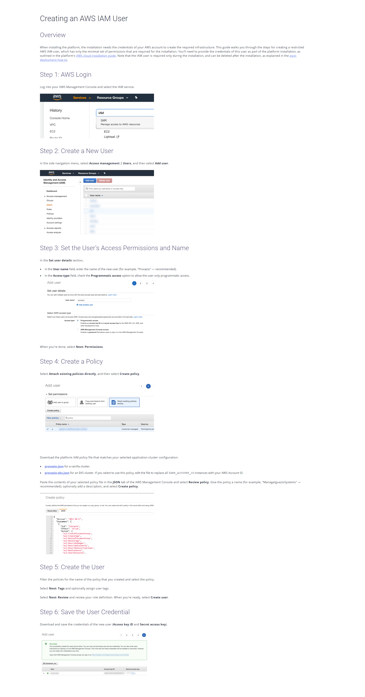

# UPDATE DNS REGISTER AND SECURITY GROUPS WITH YOUR CURRENT IP

Usually in home ISP give you a dinamic IP, so to allow refresh security groups rules and DNS REGISTER you can use this script

In the file .env you should configure your parameters. This file should stay in .gitignore file

.env file example
```
AWS_ACCESS_KEY_ID=
AWS_SECRET_ACCESS_KEY=
TTL=300
DOMAINS=home.domain.com@ZONE_ID,home1.domain.com@ZONE_ID
SECURITY_GROUPS=SECURITY_GROUP_NAME1@REGION,SECURITY_GROUP_NAME2@REGION
DESCRIPTION=ACCESS FROM HOME
```
When you access to security groups in EC2 Area you should see region in the url bar

In first place you should configure a AWS IAM and add a user with right permissions to allow start and stop machines.

Change the json policies bellow with your configurations. If you dont know how create a IAM USER you can view a similar example here


## Policies

### Route53

PAY ATENTION, you should build a policy more restrictive, this one allow you to change everything in ROUTE53
```json
{
    "Version": "2012-10-17",
    "Statement": [
        {
            "Sid": "VisualEditor0",
            "Effect": "Allow",
            "Action": "route53:*",
            "Resource": "*"
        }
    ]
}
```

### SecurityGroups

CHANGE INFO REGION_ID AND ACCOUNT_ID WITH YOUR INFO
```json
{
    "Version": "2012-10-17",
    "Statement": [
        {
            "Effect": "Allow",
            "Action": [
                "ec2:DescribeSecurityGroups",
                "ec2:DescribeSecurityGroupRules",
                "ec2:DescribeTags"
            ],
            "Resource": "*"
        },
        {
            "Effect": "Allow",
            "Action": [
                "ec2:AuthorizeSecurityGroupIngress",
                "ec2:RevokeSecurityGroupIngress",
                "ec2:AuthorizeSecurityGroupEgress",
                "ec2:RevokeSecurityGroupEgress",
                "ec2:ModifySecurityGroupRules",
                "ec2:UpdateSecurityGroupRuleDescriptionsIngress",
                "ec2:UpdateSecurityGroupRuleDescriptionsEgress"
            ],
            "Resource": [
                "arn:aws:ec2:REGION_ID:ACCOUNT_ID:security-group/*"
            ]
        },
        {
            "Effect": "Allow",
            "Action": [
                "ec2:ModifySecurityGroupRules"
            ],
            "Resource": [
                "arn:aws:ec2:REGION_ID:ACCOUNT_ID:security-group-rule/*"
            ]
        }
    ]
}
```
Change REGION_ID and ACCOUNT_ID 

This script uses AWS POWERSHELL TOOLS

Install AWS PowerShell tools 
<https://docs.aws.amazon.com/powershell/latest/userguide/pstools-getting-set-up.html>

You can execute this script manually or put it in task scheduler and create an automated task.

check also
<https://docs.microsoft.com/en-us/powershell/module/microsoft.powershell.security/set-executionpolicy?view=powershell-7.1>

